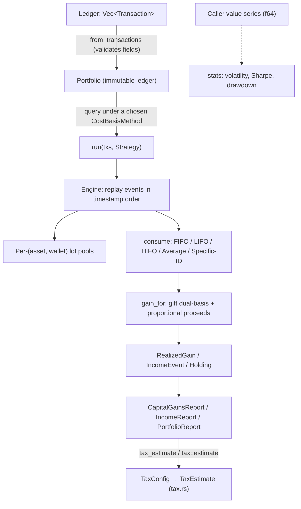

# Architecture

`coinbasis` is a single Rust library crate. Its central idea is **event-sourced
replay**: the public type stores an immutable ledger of transactions and answers
every query by replaying that ledger through an internal engine parameterized by
a cost-basis method. Nothing is precomputed or cached, so the same ledger can be
viewed under FIFO, LIFO, HIFO, Average, or Specific-ID without keeping five
copies of mutable state in sync.

## System Diagram

## Component Descriptions

### Transaction model
- **Purpose**: the single public input type — one enum variant per ledger event
  (buy, sell, crypto-to-crypto trade, income, spend, wallet transfer, gift sent,
  gift received).
- **Location**: `src/transaction.rs`
- **Key responsibilities**: hold each event's data in exact `Decimal` amounts;
  `validate()` enforces field-level invariants (positive quantities,
  non-negative values and fees) before any replay runs.

### Cost-basis method & lot selection
- **Purpose**: choose how disposals are matched to open lots.
- **Location**: `src/method.rs`
- **Key responsibilities**: the `CostBasisMethod` enum; `order_for` (the
  deterministic lot ordering for the automatic methods); and `LotSelection` —
  the map from a disposal's input index to the specific lots it consumes under
  Specific-ID.

### Replay engine
- **Purpose**: the calculation core. Turn a ledger into realized gains, income
  events, and remaining open lots.
- **Location**: `src/engine.rs`
- **Key responsibilities**: process events in timestamp order into per-`(asset,
  wallet)` lot pools; `consume_*` removes units under the active method;
  `gain_for` applies the gift dual-basis rule and computes gain vs. reported
  basis; `dispose` splits proceeds across consumed slices and classifies the
  holding period.

### Portfolio facade
- **Purpose**: the public query surface.
- **Location**: `src/portfolio.rs`
- **Key responsibilities**: construct from a ledger, then answer
  `realized_gains`, `holdings`, `income_events`, `valuation`,
  `capital_gains_report`, and `income_report` — including the `*_with_selection`
  variants for Specific-ID.

### Report & output types
- **Purpose**: the data a caller gets back.
- **Location**: `src/report.rs`
- **Key responsibilities**: `RealizedGain`, `IncomeEvent`, `Holding`,
  `AssetValuation`, `PortfolioReport`, `CapitalGainsReport`, `IncomeReport`, and
  the `Term` (short/long) holding-period classification.

### Tax estimation
- **Purpose**: turn a year's `CapitalGainsReport` into an estimated tax
  liability using a configurable rate schedule.
- **Location**: `src/tax.rs`
- **Key responsibilities**: `TaxBracket` and `TaxConfig` (flat short-term rate
  plus progressive long-term brackets, with a configurable
  `long_term_threshold_days`); `TaxEstimate` (the computed short/long gains and
  their taxes); the free function `tax::estimate` and the convenience method
  `Portfolio::tax_estimate`. Rows are reclassified against the config threshold
  at estimation time, so the holding-period split used by the tax calculation
  can differ from the one used to build the report.

### Pure statistics
- **Purpose**: portfolio analytics independent of the cost-basis engine.
- **Location**: `src/stats.rs`
- **Key responsibilities**: volatility, Sharpe ratio, max drawdown, cumulative
  and period returns over a caller-supplied `f64` value series.

### Error type
- **Purpose**: typed, descriptive failures.
- **Location**: `src/error.rs`
- **Key responsibilities**: `PortfolioError` covers insufficient lots (named per
  wallet), invalid Specific-ID selections, field-validation failures, and the
  "selection required" guard.

## Data Flow

1. A caller builds a `Vec<Transaction>` in the order events occurred and calls
   `Portfolio::from_transactions`, which validates every event's fields.
2. A query method (e.g. `realized_gains(CostBasisMethod::Fifo)`) calls the
   engine's `run`, passing a `Strategy` that captures the chosen method (or a
   Specific-ID selection).
3. The engine sorts the events by timestamp (stable, so equal-timestamp events
   keep input order) and replays them, building one lot pool per `(asset,
   wallet)`.
4. Acquisitions open lots; disposals consume lots under the active method,
   producing one realized-gain row per consumed slice with proceeds split
   proportionally and the holding period classified.
5. The facade shapes the engine's output into the requested report — a list of
   gains, a tax-year capital-gains summary, an income report, or a
   mark-to-market valuation at supplied prices.

## External Integrations

| Service | Purpose | Notes |
|---------|---------|-------|
| None | — | The crate performs no network or file I/O. The caller supplies all data — the ledger, current prices for valuation, and any value series for statistics. |

## Key Architectural Decisions

### Event-sourced replay over mutable running balances
- **Context**: a portfolio must be viewable under several cost-basis methods,
  and tax rules depend on the full history (holding periods, transfer
  provenance), not just current balances.
- **Decision**: store the ledger immutably and recompute on each query by
  replaying it through a method-parameterized engine.
- **Rationale**: one ledger answers all five methods with no risk of stale or
  divergent state. The rejected alternative — maintaining live per-method lot
  pools — would mean five mutable copies, five chances for an update bug, and
  far more state to reason about. Replay cost is trivial for realistic ledgers.

### One disposal path for five methods via a `Strategy` enum
- **Context**: Specific-ID has awkward ergonomics (the caller must name which
  lots each disposal draws from), while the automatic methods just need an
  ordering rule.
- **Decision**: a `Strategy` enum (`Auto(method)` vs. `Specific(&selection)`)
  funnels all five methods through a single `run`/`dispose` path; only one
  `consume_specific` function knows about caller-named lots.
- **Rationale**: the special case stays isolated instead of leaking
  `Option<selection>` parameters into every query method.

### Exact decimal money math, floats only for statistics
- **Context**: cost-basis accounting must conserve value to the cent — rounding
  drift is a correctness bug, not a cosmetic one.
- **Decision**: every monetary field uses `rust_decimal::Decimal`; only the
  statistics module (volatility, Sharpe, drawdown) uses `f64`, where exactness
  is neither expected nor meaningful.
- **Rationale**: base-10 decimals make conservation exact — consumed basis plus
  remaining basis equals acquired basis, verified by property tests over random
  ledgers. Binary floats would silently lose fractions of a cent.

### Per-`(asset, wallet)` lot pools with explicit transfers
- **Context**: US cost-basis rules apply per account, and moving coins between
  your own wallets is non-taxable but must preserve basis and the
  holding-period clock.
- **Decision**: pools are keyed by the `(asset, wallet)` pair; a disposal can
  only draw from the wallet it names, and a `Transfer` re-homes lots between
  pools while preserving their basis, acquisition date, and identity. A network
  fee paid in the asset is treated as a separate taxable disposal at its market
  value.
- **Rationale**: this models the real tax treatment directly, and an oversell
  surfaces a per-wallet error rather than silently borrowing from another
  account.

### Gift dual-basis decoupled from the event type
- **Context**: the IRS dual-basis rule for gifts is the subtlest calculation in
  the crate — carryover basis for gains, the lesser of (donor basis, fair value
  at receipt) for losses, and no gain or loss for sale prices between them.
- **Decision**: that math lives in one function (`gain_for`) operating on a
  neutral "consumed slice," not on the transaction variant, so any disposal of a
  gifted lot — under any method — reuses the same logic.
- **Rationale**: keeping the rule in one place makes it testable in isolation
  and impossible to get inconsistently right across the different disposal
  paths.

### Tax estimation as a read-only layer over `CapitalGainsReport`
- **Context**: callers want an estimated tax liability, but the holding-period
  threshold used for rate purposes (a policy choice) is independent of the
  threshold used to build the `CapitalGainsReport`. The threshold could also
  differ by jurisdiction.
- **Decision**: `src/tax.rs` is a pure function (`tax::estimate`) that accepts
  an existing `CapitalGainsReport` and a `TaxConfig` and reclassifies rows
  against the config's `long_term_threshold_days` at estimation time. The
  `Portfolio::tax_estimate` method is a one-shot convenience wrapper that builds
  the report and immediately estimates.
- **Rationale**: separating estimation from reporting keeps the core engine
  untouched and lets the same `CapitalGainsReport` be re-estimated under
  multiple rate configs without re-running the ledger. The reclassification step
  means Average-method rows (which carry no `acquired_at`) fall back to their
  stored `term`, while date-bearing rows are always re-evaluated from actual
  holding days.

### Two-stage validation: fields up front, availability at replay
- **Context**: some invalid inputs are obvious immediately (a negative
  quantity); others depend on history (selling more than a wallet holds).
- **Decision**: `Transaction::validate` rejects malformed fields at construction
  time; lot-availability and Specific-ID errors surface during replay.
- **Rationale**: cheap, eager rejection of obviously-bad input, while the checks
  that genuinely require replay order are deferred to where that order exists.
